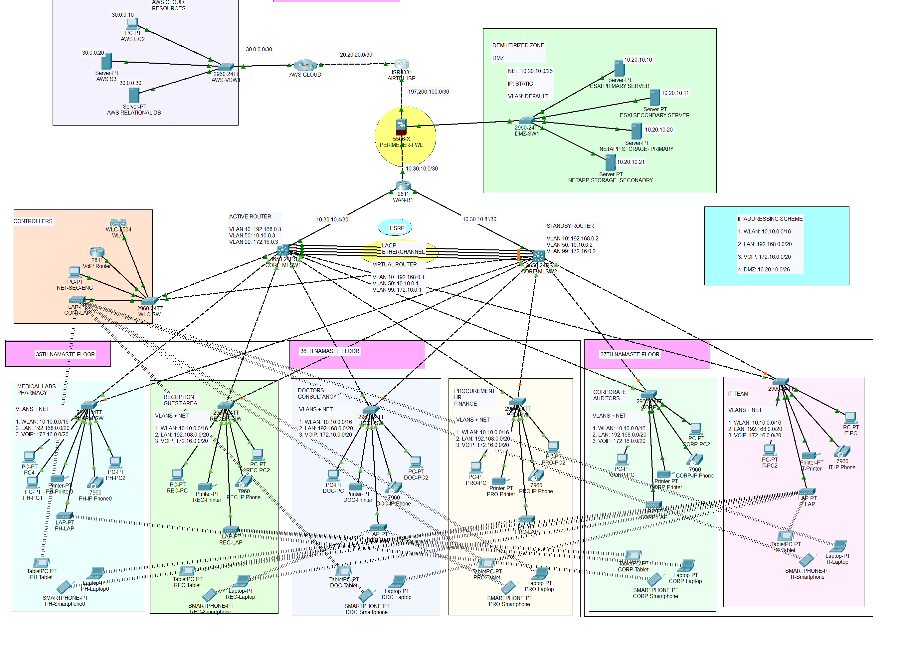

#  Design and Implementation of a Secure Healthcare Network System 

##  Case Study

A healthcare service provider , specializing in diagnostic tests on blood, urine, and human tissue. The company uses IT solutions to securely access, manage, and deliver its services.

###  Office Setup 

| Floor | Departments                                         | Users |
|-------|------------------------------------------------------|-------|
| 35th  | Medical Labs, Pharmacy, Reception, Guest Area       | 200 + 1000 |
| 36th  | Doctors, Consultancy, Procurement, HR, Finance      | 200 + 300 |
| 37th  | Corporate Auditors, IT Team                         | 120 + 300 |

>  All departments are expected to double in users by 2025.

---

##  Project Goals

- Design a secure, scalable, and redundant enterprise network
- Meet performance, security, and availability goals
- Ensure **Confidentiality**, **Integrity**, and **Availability (CIA)** of data

---

##  Technologies and Design Requirements

###  Internet Service
- **ISP**: Airtel connection for public access and internet services

###  Network Security
- **Firewall**: Cisco ASA 5500-X Series
- **Security Zones**: LAN, WLAN, VoIP, DMZ (isolated segments)

###  IP Address Allocation

| Zone   | CIDR Range           |
|--------|----------------------|
| WLAN   | 10.10.0.0/16         |
| LAN    | 192.168.0.0/20       |
| Voice  | 172.16.0.0/20        |
| DMZ    | 10.20.20.0/26        |
| Public | 197.200.100.0/24     |

---

###  Network Equipment

- **Cisco WAN Router** – Also handles VoIP services
- **Switches**:
  - 2× Catalyst 3850 (48-port)
  - 8× Catalyst 2960 (48-port)
  - 2× Catalyst 2960 (24-port)

---

###  Servers and Storage

- **2× HP ProLiant DL38 Gen10**:
  - Virtualization via VMware ESXi
  - Red Hat Directory Server (LDAP, DNS, DHCP)
  - Health Information System
  - Email Server
  - File Server

- **NetApp Storage**:
  - Primary & Secondary Storage (used in DMZ)

---

###  Cloud Integration

- **AWS Cloud**:
  - For global client services
  - EC2 & Relational Database
  - Used by cloud engineers and developers

---

###  Voice and Wireless

- **VoIP**: Cisco Voice Gateways (configured on WAN router)
- **WLAN**: 
  - 10 Wireless Access Points (LAPs)
  - Cisco Wireless LAN Controller (WLC)

---

##  Logical Design and Best Practices

###  Technologies Implemented

- **Cisco Packet Tracer** – Simulation and testing
- **Hierarchical Design Model** – With redundancy
- **VLANs**: 
  - VLAN 10 – LAN
  - VLAN 50 – WLAN
  - VLAN 99 – VoIP

- **LACP EtherChannel** – Link aggregation
- **STP PortFast + BPDU Guard** – Loop prevention
- **HSRP** – High availability for core routing
- **Inter-VLAN Routing** – Enabled on multilayer switches
- **OSPF** – As the interior gateway routing protocol
- **ACL for SSH** – Only allows Senior Security Engineer to SSH
- **Static IPs** – Used for servers and firewalls
- **Dynamic IPs** – DHCP for all client devices

---

###  Final Testing

The entire system was:
- **Fully implemented**
- **Tested**
- **Verified** for:
  - Inter-VLAN communication
  - Cloud access
  - Internet connectivity
  - VoIP call routing
  - Wireless access control
  - Redundancy/failover via HSRP
  - Proper subnet allocation

---

##  Network Topology

The following screenshot represents the full topology as implemented:

---

##  Conclusion

This project delivers a fully scalable and secure healthcare IT infrastructure, fulfilling all business and technical requirements. It is designed for future growth and high availability, ensuring strong performance in real-world deployments.

---

