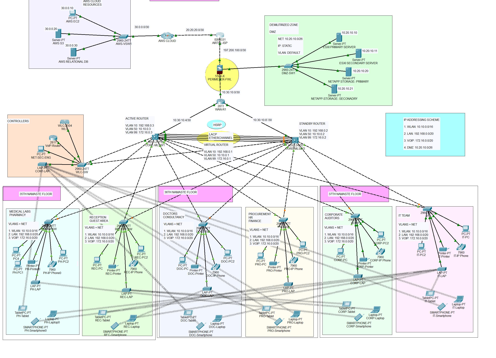

#  Secure Healthcare Network System

This project is a complete design and implementation of a secure, scalable, and robust healthcare network system.

##  Project Structure

- `Secure_Healthcare_Network.pkt` – Cisco Packet Tracer project file (fully implemented and tested).
- `Network_Topology.png` – Network topology screenshot.
- `Project_Description.md` – Full project documentation and requirements.

##  Overview

 This secure network design covers:

- 3-floor enterprise setup
- LAN, WLAN, VoIP with VLAN separation
- HSRP for high availability
- Cisco ASA Firewall configuration
- AWS cloud integration
- DHCP, DNS, LDAP, and internal servers
- NetApp storage
- VoIP and WiFi across departments
- OSPF routing
- Access control via ACL

##  Technologies Used

- Cisco Packet Tracer
- VLANs, Inter-VLAN Routing
- Cisco ASA 5500-X Firewall
- EtherChannel (LACP)
- HSRP
- OSPF Routing
- DHCP, DNS, LDAP via Red Hat Directory Server
- VoIP
- AWS Cloud Services
- Standard ACL for SSH access

## Security Architecture

The network ensures **Confidentiality, Integrity, and Availability** by:
- Using Cisco ASA zones
- Separating traffic via VLANs
- Implementing HSRP + EtherChannel for failover
- Centralized DHCP with secure DNS and LDAP
- ACLs for SSH control
- VoIP isolation

##  Author

Figuigui Miloud

##  License

This project is open-source and available under the MIT License.
